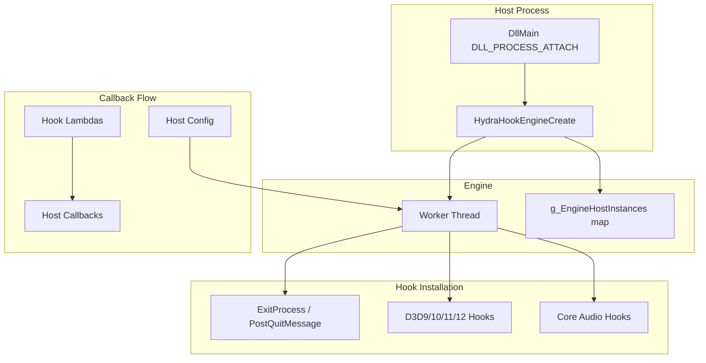

# HydraHook Internals

Developer-focused documentation for the HydraHook library. This document explains the architecture, components, and extension points for developers working on or integrating with HydraHook.

## Overview and Purpose

**HydraHook** is a Windows DLL that hooks Direct3D (9, 10, 11, 12) and Core Audio APIs in host processes. It is designed for injection into games and applications to intercept the render and audio pipelines.

**Typical use cases:**
- Overlays (e.g., ImGui-based UIs)
- Mods and enhancements
- Debugging and profiling tools
- Capture and recording utilities

**Design:**
- C API surface for host integration
- Microsoft Detours for function interception
- Configurable per-API enablement via `HYDRAHOOK_ENGINE_CONFIG`
- Pre/post callbacks for each hooked API

## Architecture

1. Host process loads HydraHook DLL (typically via injection).
2. `HydraHookEngineCreate` spawns a worker thread and registers the engine in `g_EngineHostInstances`.
3. Worker thread installs `ExitProcess` and `PostQuitMessage` hooks for graceful shutdown, then D3D and Core Audio hooks based on config.
4. When the host calls hooked APIs, Detours redirects to hook lambdas, which invoke host callbacks before/after the original function.

## Directory Layout

| Path | Purpose |
|------|---------|
| `Engine.cpp` / `Engine.h` | Engine lifecycle, HMODULE mapping, logging, custom context, C API implementation |
| `Game/Game.cpp` / `Game.h` | Main hook worker thread, hook installation, shutdown handling |
| `Game/Hook/` | Per-API vtable probing and hook targets (Direct3D9, Direct3D9Ex, Direct3D10/11/12, DXGI, AudioRenderClient) |
| `Utils/Hook.h` | Detours wrapper template (stdcall/cdecl, apply/remove/call_orig) |
| `Global.h` | `expand_environment_variables`, `process_name` |
| `Exceptions.hpp` | DetourException, ModuleNotFoundException, ARCException, etc. |

## Core Components

### Engine

**Files:** [Engine.cpp](Engine.cpp), [Engine.h](Engine.h)

- **`g_EngineHostInstances`**: Static map from `HMODULE` to `PHYDRAHOOK_ENGINE`. Allows multiple host DLLs to each have their own engine instance.
- **Engine creation**: `GetModuleHandleEx` to increment host DLL refcount, `malloc` for engine struct, spdlog setup, `CreateEvent` for cancellation, `CreateThread` for `HydraHookMainThread`.
- **Custom context**: `HydraHookEngineAllocCustomContext` allocates host-owned memory accessible from all event callbacks via `Extension->Context` or `HydraHookEngineGetCustomContext`.
- **Per-API callback tables**: `EventsD3D9`, `EventsD3D10`, `EventsD3D11`, `EventsD3D12`, `EventsARC` hold function pointers for pre/post hooks.

### Main Thread

**Files:** [Game/Game.cpp](Game/Game.cpp), [Game/Game.h](Game/Game.h)

- **`HydraHookMainThread`**: Entry point for the worker thread. Receives `PHYDRAHOOK_ENGINE` as `LPVOID`.
- **Flow**: Install ExitProcess/PostQuitMessage hooks -> Install D3D/Audio hooks (based on config) -> `WaitForSingleObject(EngineCancellationEvent)` -> Remove hooks -> `FreeLibraryAndExitThread`.
- **D3D10/11**: Share the same `IDXGISwapChain` vtable. The D3D10 path probes first and detects D3D11 via `GetDevice(__uuidof(ID3D11Device))` when Present is first called.
- **D3D12**: Two capture paths for `ID3D12CommandQueue`:
  - **Early injection**: Hook `IDXGIFactory::CreateSwapChain` and `CreateSwapChainForHwnd`; `pDevice` is the command queue.
  - **Mid-process injection**: Hook `ID3D12CommandQueue::ExecuteCommandLists`; capture device->queue mapping at runtime.

### Hook Template

**File:** [Utils/Hook.h](Utils/Hook.h)

- **`Hook<CallConvention, retn, args...>`**: RAII wrapper over Microsoft Detours.
- **Methods**: `apply(target, detour)`, `remove()`, `call_orig(...)`.
- **Transaction management**: `DetourTransactionBegin` / `DetourUpdateThread` / `DetourAttach` / `DetourTransactionCommit` (or `Abort` on failure).
- **Calling conventions**: `CallConvention::stdcall_t` and `CallConvention::cdecl_t`.

### Vtable Probers

**Directory:** [Game/Hook/](Game/Hook/)

- **D3D9Ex**: Creates a temporary hidden window via `Window`, loads `d3d9.dll`, calls `Direct3DCreate9Ex` -> `CreateDeviceEx` -> extracts vtable from the device. Used for both D3D9 and D3D9Ex hooks.
- **D3D10/11/12**: Load DXGI/D3D DLLs, create factory/device/swap chain, extract vtable from the swap chain.
- **DXGI**: [DXGI.h](Game/Hook/DXGI.h) defines vtable indices (e.g. `Present = 8`, `ResizeBuffers = 13`, `ResizeTarget = 14`).
- **AudioRenderClient**: Uses MMDevice API (`IMMDeviceEnumerator` -> `IMMDevice` -> `IAudioClient` -> `IAudioRenderClient`) to obtain the vtable.

## Hooking Flow (Per Frame)

For a typical `IDXGISwapChain::Present` hook:

1. Host calls `IDXGISwapChain::Present`.
2. Detour redirects execution to the hook lambda.
3. **First call only** (`std::call_once`): Store swap chain in `engine->RenderPipeline.pSwapChain`, invoke `EvtHydraHookGameHooked`.
4. **Pre-callback** (if set): `EvtHydraHookD3D11PrePresent` with `HYDRAHOOK_EVT_PRE_EXTENSION` (engine handle, custom context).
5. **Original call**: `swapChainPresent11Hook.call_orig(chain, SyncInterval, Flags)`.
6. **Post-callback** (if set): `EvtHydraHookD3D11PostPresent` with `HYDRAHOOK_EVT_POST_EXTENSION`.
7. Return result to host.

## Shutdown Handling

To avoid DLL unload races and loader-lock issues, HydraHook hooks `ExitProcess` and `PostQuitMessage`:

- **On trigger**: `EvtHydraHookGamePreExit` -> `SetEvent(EngineCancellationEvent)` -> `WaitForSingleObject(EngineThread, 3000)` -> `exitProcessHook.call_orig` (or `postQuitMessageHook.call_orig`).
- **Main thread**: Wakes from `WaitForSingleObject`, invokes `EvtHydraHookGamePreUnhook`, removes all hooks, invokes `EvtHydraHookGamePostUnhook`, then `FreeLibraryAndExitThread(engine->HostInstance, 0)`.
- The other hook (`PostQuitMessage` or `ExitProcess`) is removed to avoid double cleanup.

## Build Configuration

- **Output**: DLL (Debug/Release) or static library (Debug_LIB/Release_LIB). See [HydraHook.vcxproj](HydraHook.vcxproj).
- **Preprocessor defines** to exclude APIs:
  - `HYDRAHOOK_NO_D3D9`
  - `HYDRAHOOK_NO_D3D10`
  - `HYDRAHOOK_NO_D3D11`
  - `HYDRAHOOK_NO_D3D12`
  - `HYDRAHOOK_NO_COREAUDIO`
- **Dependencies**: vcpkg (spdlog, detours).
- **Public headers**: `include/HydraHook/Engine/` (HydraHookCore.h, HydraHookDirect3D9.h, HydraHookDirect3D10.h, HydraHookDirect3D11.h, HydraHookDirect3D12.h, HydraHookCoreAudio.h).

## Extending HydraHook

### Adding a New D3D Version

1. Add a vtable prober class in `Game/Hook/` (e.g. inherit from `Direct3DBase` or follow the DXGI pattern).
2. Add hook installation in `Game.cpp` inside the appropriate `#pragma region`.
3. Add callback struct and `HydraHookEngineSetD3D*EventCallbacks` in `include/HydraHook/Engine/`.
4. Add `EventsD3D*` and `INVOKE_D3D*_CALLBACK` macro in [Engine.h](Engine.h).

### Adding a New Hook Target

1. Declare a `Hook<>` instance (static in `HydraHookMainThread`).
2. Obtain the target address (vtable index or exported function).
3. Call `hook.apply(target, lambda)` with a lambda that invokes pre/post callbacks and `call_orig`.
4. Register the callback in the engine config and callback struct.

### Custom Context

- Call `HydraHookEngineAllocCustomContext` before hooks run (e.g. in `EvtHydraHookGameHooked`).
- Access from callbacks via `HydraHookEngineGetCustomContext(Engine)` or `Extension->Context` in D3D11/12/ARC callbacks.
- Free with `HydraHookEngineFreeCustomContext` before engine destroy.

## Exception Handling

| Exception | Cause |
|-----------|-------|
| `DetourException` | Detours API failures (attach/detach, transaction errors, target too small) |
| `ModuleNotFoundException` | Required DLL not loaded (e.g. d3d9.dll) |
| `ProcAddressNotFoundException` | GetProcAddress failed |
| `ARCException` | Core Audio COM failures (HRESULT) |
| `DXAPIException` | DirectX COM failures (HRESULT) |

All are caught in `Game.cpp` with `logger->error` or `logger->warn`; the engine continues and skips the failed API.

## File Reference

| File | Description |
|------|-------------|
| [Engine.cpp](Engine.cpp) | C API implementation: create, destroy, context, callbacks, logging |
| [Engine.h](Engine.h) | Internal engine struct, callback invocation macros |
| [Game/Game.cpp](Game/Game.cpp) | Main thread: hook installation, shutdown, D3D/Audio wiring |
| [Game/Game.h](Game/Game.h) | `HydraHookMainThread` declaration, `GetD3D12CommandQueueForSwapChain` |
| [Utils/Hook.h](Utils/Hook.h) | Detours `Hook<>` template |
| [Global.h](Global.h) | Environment expansion, process name |
| [Exceptions.hpp](Exceptions.hpp) | Exception types |
| [Game/Hook/Direct3DBase.h](Game/Hook/Direct3DBase.h) | Abstract base for D3D vtable probers |
| [Game/Hook/Direct3D9.h](Game/Hook/Direct3D9.h) | D3D9 vtable indices |
| [Game/Hook/Direct3D9Ex.h](Game/Hook/Direct3D9Ex.h), [.cpp](Game/Hook/Direct3D9Ex.cpp) | D3D9Ex prober |
| [Game/Hook/Direct3D10.h](Game/Hook/Direct3D10.h), [.cpp](Game/Hook/Direct3D10.cpp) | D3D10 prober |
| [Game/Hook/Direct3D11.h](Game/Hook/Direct3D11.h), [.cpp](Game/Hook/Direct3D11.cpp) | D3D11 prober |
| [Game/Hook/Direct3D12.h](Game/Hook/Direct3D12.h), [.cpp](Game/Hook/Direct3D12.cpp) | D3D12 prober |
| [Game/Hook/DXGI.h](Game/Hook/DXGI.h) | IDXGISwapChain vtable indices |
| [Game/Hook/Window.h](Game/Hook/Window.h), [.cpp](Game/Hook/Window.cpp) | Temporary window for D3D device creation |
| [Game/Hook/AudioRenderClientHook.h](Game/Hook/AudioRenderClientHook.h), [.cpp](Game/Hook/AudioRenderClientHook.cpp) | Core Audio prober |
